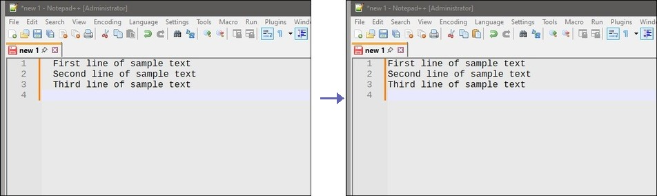

# Claude Clipboard Fix

A fast, native Windows utility that strips the 2-space prefix from text copied from Claude Code output. Reads the clipboard, fixes it in place, done.

> **Latest Version**: 1.1.1 | [See What's New](CHANGELOG.md)

Claude Code's terminal renderer adds 2-space leading padding to every line. When you select and copy text, that padding comes along. This tool removes it.



## Usage

1. Select and copy text from Claude Code output
2. Run `ccfix.exe` (via Everything, hotkey, command line, etc.)
3. Paste - the clipboard now has clean text

The tool is silent - no window, no output. It just fixes the clipboard and exits.

## Requirements

- Windows 10/11
- Go 1.21 or later (for building)

## Building

```bash
go build -o dist/ccfix.exe -ldflags="-s -w" main.go
```

The `-ldflags="-s -w"` flags strip debug info to reduce binary size.

## Related

- [Claude Code issue #15199](https://github.com/anthropics/claude-code/issues/15199) - Leading padding in output
- [Claude Code issue #18170](https://github.com/anthropics/claude-code/issues/18170)
- [Claude Code issue #23014](https://github.com/anthropics/claude-code/issues/23014)


## Provenance

This tool was authored by [Fanis Hatzidakis](https://github.com/fanis/claude-clipboard-fix) with assistance from large-language-model tooling (Claude Code).
All code was reviewed, tested, and adapted by Fanis.


## Licence

Copyright (c) 2026 Fanis Hatzidakis

Licensed under PolyForm Internal Use License 1.0.0

See LICENCE.md
